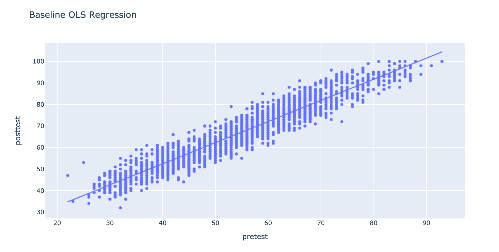

# Predicting Student Test Scores

**Authors**: <br>[Taylor Hale Robert](mailto:taylorhale11@gmail.com)
                <br>[Dalton Rabb](mailto:drabb138@gmail.com)


## Overview

This project uses a variety of enviromental variables to predict student test scores using linear regression.

## Data Sources & Features

[Kaggle student test data](https://www.kaggle.com/spscientist/students-performance-in-exams) data was used for our analysis

We used posttest scores as the target variable in our analysis. Posstest score can be interpreted as grades, where grades are given on a scale of 0-100 where 90-100 is an A, 80-90 is a B and so on.

View EDA code here.


## Summary
### Baseline Model

First, we explored a baseline regression model to understand how well the school system currently predicts scores using only pretest data. ~90% of the variation observed in posttest scores can be explained as a function of pretest scores. The residuals for this model were normally distributed, and the RMSE for this model is 4.33, which is a little less than ½ a grade.

### Predicting Student Performance as a Function of Environmental Variables
Because the school system is interested in how well they might predict student performance without the added expense of pretesting, we moved on to build a model that did not use pretest scores, and used only environmental information about the school and classroom to predict posttest performance.
The initial model had an R2 value of .86 and an RMSE of 6.34. After checking the residuals it became clear that the model suffered from overfitting.

Using recursive feature elimination we improved this performance of the model to have an RMSE of 5.71 and R-squared of 0.83, and saw improvement in cross validation scores.

I was particularly surprised to see that estimating student performance as a target of environmental predictors alone can be fairly successful. While this model explains 85% of the variance in the data as opposed to the 90% achieved in the pretest model, and the RMSE is 1.4 grade points higher, I expect this model would still be useful as it provides a high level of insight without requiring the more laborious-to-collect pretest scores.

### Improving Current Practice Utilizing Multiple Linear Regression
To understand how the school system might improve models to achieve the most reliable predictions, we then created a model using both pretest data and environmental data as predictors for the target variable, posttest score.

Much like in the environmental factors model, we ran into some over fitting and and treated it mostly using recursive feature elimination.

This model performs well in the prediction of posttest scores for students. The RMSE is 3.31, approximately a third of a grade, and 95% of the variance in the data is explained by this model.

## For More Information

See the full analysis in the [Jupyter Notebook](./THR_final_models.ipynb) or review this [presentation](./Test_Score_Presentation.pdf).

For additional info, contact the authors at:<br>
[Taylor Hale Robert](mailto:taylorhale11@gmail.com)
<br>[Dalton Rabb](mailto:drabb138@gmail.com)


## Repository Structure

```
├── code
│   ├── EDA.ipynb
│   ├── THR_final_models.ipynb
│   ├── THR_prelim_modeling.ipynb
│   └── files
├── data
│   └── test_scores 2.csv
├── images
│   ├── nguyen-dang-hoang-nhu-qDgTQOYk6B8-unsplash.jpg
│   ├── dom-fou-YRMWVcdyhmI-unsplash.jpg
│   ├── EDA.png
│   └── baseline.png
├── .gitignore
├── README.md
└── Test_Score_Presentation.pdf
